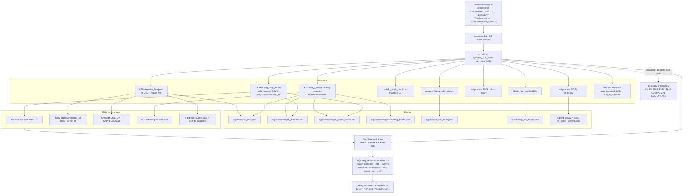

# H3BUP Daily — Arquitetura atual (V1 oficial) — 20260729

**Status auditado:** `DAILY_AUDIT_TECHNICAL_GAPS`  
**Publicação oficial:** Daily V1 (`ops.daily_full_report`) via Telegram PDF  
**V2:** implementado em shadow (`DAILY_V2_IMPLEMENTED_SHADOW` / `DAILY_REDESIGN_COMPLETE_SHADOW`); **não** substitui V1  
**Escopo:** apenas reporting. Este documento **não** descreve nem autoriza alterações de policy/execução/ordens.

---

## 1. Resumo executivo

O relatório diário oficial H3BUP/BetinAsia é produzido pelo monólito `ops/daily_full_report.py` (~7k LOC), agendado por systemd timer às **22:00 UTC** (19:00 BRT). O pipeline mistura:

- janelas UTC (aderência 7d, dia do relatório = data UTC de geração);
- KPIs rolling 24h do executor;
- P&L accounting em `REPORT_TZ=America/Sao_Paulo` (`pnl_today`);
- coortes dualistas (post date UTC vs `created_at` UTC + join por `order_id`).

A saída oficial é `logs/daily_reports/{YYYYMMDD}/report_daily.md` + PDF + artefactos JSON, com overwrite no mesmo dia, **sem** escrita atómica de md/pdf, **sem** symlink `latest`, **sem** last-known-good. Publicação: Telegram (`DAILY_REPORT_TELEGRAM`).

Secções H3BUP (Accounting Health / E2E / CLV) foram injectadas por scripts de patch string. Bug P0 histórico: uso de `out_lines` onde o builder usava `s0` — **corrigido em Phase 2R** para `s0.append`. Falhas de secção ainda são frequentemente engolidas por `except: pass` / `except Exception: pass`.

---

## 2. Componentes e responsabilidades

| Componente | Papel | Oficial? |
|---|---|---|
| `betinasia-daily-full-report.timer` | Agenda OnCalendar `*-*-* 22:00:00 UTC`, `Persistent=true`, `RandomizedDelaySec=180` | Sim (trigger) |
| `betinasia-daily-full-report.service` | Executa `python -m ops.daily_full_report` | Sim |
| `ops/daily_full_report.py` | Orquestração V1: accounting, OOS/WF, KPIs, markdown, PDF, Telegram | Sim |
| `ops/accounting_daily_report.py` | Snapshot balance/open + `pnl_today` em REPORT_TZ | Input V1 |
| `ops/accounting_health_report.py` | Render secção Accounting Health — H3BUP (ROI settled fraction) | Input V1 (patch) |
| `ops/h3bup_accounting_reconcile.py` | Reconciliação LIVE_OK ↔ ledger; `roi_settled` | Input health |
| `ops/analyze_h3bup_e2e_latency.py` + `h3bup_e2e_trace` | Latência E2E | Input V1 (patch) |
| `logs/h3bup_clv_health.json` (+ workers CLV) | CLV forward collection | Input V1 (patch) |
| `ops/patch_daily_*_section.py` | Injectores idempotentes de secções H3BUP | Manutenção |
| `betinasia-accounting-daily.timer` | Accounting diário paralelo ~22:00 UTC | Separado |
| `betinasia-daily-dt-report` | Relatório DT — **não misturar** com H3BUP Daily | Fora de escopo |
| `ops/daily_v2/*` | Pipeline V2 extract/canonical/render (shadow) | Shadow only |

---

## 3. Diagrama de fluxo (timer → Telegram)



---

## 4. Camadas lógicas (V1 — de facto)

1. **Agendamento:** systemd timer/service (não cron ad-hoc).
2. **Entrypoint:** `asyncio.run(run_daily_full(cfg))`.
3. **Dia do relatório:** `day = ts_utc.strftime("%Y%m%d")` — data UTC do instante de geração (não “ontem fechado” estrito).
4. **Extracção ad-hoc:** leituras JSONL/CSV/DB/subprocess espalhadas no monólito.
5. **Agregação:** funções internas (`_agg_roiw`, KPIs, aderência, tese fast).
6. **Render:** listas `s0`/`s1`/`extra` concatenadas → `report_daily.md`.
7. **PDF:** `docs/render_markdown_to_pdf.py` via subprocess.
8. **Publicação:** Telegram PDF; fallback mensagem texto se falhar.

Não há envelope canónico V1 com `schema_version`, `run_id`, `report_health` ou `report_cutoff_utc`.

---

## 5. Dual cohort (ponto crítico)

| Uso | Timestamp | Join | Notas |
|---|---|---|---|
| P&L accounting diário / séries | **post date UTC** (e `pnl_today` em REPORT_TZ) | ledger rows | Não é coorte operacional H3BUP |
| **ROIw Total** (tabela principal por dia exec) | **`created_at` UTC** | `order_id` ↔ balance | Inclui open se no ledger; void≈0; oid em falta excluído |
| ROI settled (health H3BUP) | coorte LIVE_OK + settle as-of | `order_id` | Open **excluído** do denominador; fraction |

Filtro de policy `H3BUP_vNext` **não** é aplicado de forma consistente à tabela principal de ROIw V1 (mistura de universo Back LIVE_OK sem needle H3BUP obrigatório).

---

## 6. Conceitos “fast” misturados (V1)

| Conceito | Campo | Limiar | Onde |
|---|---|---|---|
| Fast antigo (pré-tese) | `pre_submit_ms` | ≤ **6000** ms | tese Back Pre; env `DAILY_BACKPRE_FAST_OLD_MAX_PRE_SUBMIT_MS` |
| Fast pós-tese (desde ~2026-04-20) | `pre_submit_ms` | ≤ **5000** ms | `EXECUTOR_BACKPRE_FAST_MAX_PRE_SUBMIT_MS` |
| Contrafactual “lat≤6s” | `call_to_done_ms` | ≤ **6000** ms | filtros contrafactuais ROIw |

Contrato de utilizador (V2 / Phase 2R): separar **`DAILY_FAST_LE_6S`** (`pre_submit_ms ≤ 6000`) de **`STUDY_FAST_LT_4S`** (`pre_submit_ms < 4000`). V1 não formaliza estes IDs.

---

## 7. Outputs e persistência

```
logs/daily_reports/{YYYYMMDD}/
  report_daily.md          # overwrite same-day; NÃO atómico
  report_daily.pdf         # overwrite; NÃO atómico
  accounting_daily_report.json
  (muitos JSON de OOS/WF/aderência/KPIs)
```

Histórico = pastas por dia. Sem `latest` symlink. Sem last-known-good. Rerun no mesmo UTC day substitui artefactos.

---

## 8. Timers adjacentes (não misturar)

- `betinasia-accounting-daily.timer` — ~22:00 UTC; accounting only.
- `betinasia-daily-dt-report` — domínio **DT**; fora do perímetro H3BUP Daily.
- Workers CLV (`betinasia-h3bup-clv-*.service`) — colecta contínua; Daily só lê health/artefactos.

---

## 9. Lacunas técnicas auditadas (índice)

Ver `logs/h3bup_daily_current_issues_20260729.csv`. Destaques P0/P1:

- envelope V1 sem health/run_id/cutoff;
- swallow massivo de excepções;
- escrita não atómica md/pdf;
- misturas de tempo e de “fast”;
- policy H3BUP não filtrada no ROIw principal;
- fair edge **não implementado** (risco de parecer “omitido” em vez de `NOT_IMPLEMENTED`);
- secções H3BUP dependentes de patch (agora com `s0.append` pós-fix P0).

---

## 10. Relação com V2

V2 (`ops/daily_v2`) introduz 3 camadas (extract → canonical snapshot → render), atomic IO, LKG, latest symlink, contratos de métrica e health model. Flags shadow típicas:

```
H3BUP_DAILY_V2_ENABLED=1
H3BUP_DAILY_V2_PUBLISH=0
H3BUP_DAILY_V2_COMPARE_V1=1
H3BUP_DAILY_V2_FAIL_OPEN=1
```

**Gates de publicação V2:** paridade pendente; V1 permanece oficial. Ver `docs/h3bup_daily_v2_design_20260729.md`.

---

## 11. Garantias de não-impacto operacional

Phase 2R / este audit package:

- **não** altera policy, stake, bridge, executor, collectors E2E/CLV workers (além de docs/logs);
- respostas de verificação **74–76 = Não** (sem efeito em execução/policy/ordens).
