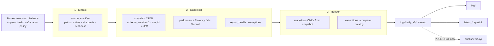

# H3BUP Daily V2 — Design — 20260729

**Status:** `DAILY_V2_IMPLEMENTED_SHADOW` / `DAILY_REDESIGN_COMPLETE_SHADOW`  
**Publicação oficial:** **não** (gates: paridade pendente; V1 permanece oficial)  
**Princípio:** reporting only — fail-open — sem alterar policy/stake/execução/accounting writers/E2E collectors/CLV workers.

---

## 1. Objectivos

1. Separar **extract / canonical / render**.
2. Congelar **coorte** em `created_at` UTC half-open + `report_cutoff_utc`.
3. Formalizar métricas (`roi_settled` principal; ROIw legado complementar).
4. Separar **DAILY_FAST_LE_6S** e **STUDY_FAST_LT_4S**.
5. Emitir health/status em vez de engolir falhas.
6. Atomic writes + latest + LKG.
7. Declarar **fair_edge = NOT_IMPLEMENTED** (nunca 0).
8. Filtrar policy **H3BUP_vNext** no universo operacional.
9. Correr em **shadow** sem Telegram oficial.

---

## 2. Arquitectura em 3 camadas



### Módulos

| Módulo | Responsabilidade |
|---|---|
| `ops/daily_v2/extract.py` | Manifesto de fontes + freshness |
| `ops/daily_v2/time_windows.py` | DAILY_CLOSED / INTRADAY |
| `ops/daily_v2/universes.py` | LIVE_OK Back H3BUP dedupe; fast buckets |
| `ops/daily_v2/performance.py` | settlement + roi_settled + roiw v1/v2 |
| `ops/daily_v2/statuses.py` | Vocabulários + `metric_envelope` |
| `ops/daily_v2/contracts.py` | Catálogo machine-readable |
| `ops/daily_v2/canonical.py` | `build_snapshot` |
| `ops/daily_v2/render.py` | Markdown sem recalcular |
| `ops/daily_v2/io_atomic.py` | write atómico, latest, LKG |
| `ops/daily_v2/compare_v1.py` | Diff shadow vs V1 md |
| `ops/daily_v2/__main__.py` | CLI + flags |

Schema: `schemas/h3bup_daily_v2_schema.json`.

---

## 3. Flags shadow (deploy auditado)

```text
H3BUP_DAILY_V2_ENABLED=1
H3BUP_DAILY_V2_PUBLISH=0
H3BUP_DAILY_V2_COMPARE_V1=1   # env COMPARE / COMPARE_V1
H3BUP_DAILY_V2_FAIL_OPEN=1
```

CLI: `python -m ops.daily_v2 [--report-date YYYY-MM-DD] [--v1-md PATH] [--publish]`.

Comportamento:

- `ENABLED=0` → skip exit 0;
- falha com `FAIL_OPEN=1` → grava `h3bup_daily_v2_last_error.json`, exit 0 (não derruba V1);
- `PUBLISH=0` → não escreve `published/` e não Telegram;
- `COMPARE=1` → `logs/h3bup_daily_v1_vs_v2_{day}.csv`.

---

## 4. Envelope canónico (obrigatório)

Campos required (schema):

`schema_version`, `run_id`, `report_type`, `report_date_utc`, `window_start_utc`, `window_end_utc`, `report_cutoff_utc`, `generated_at_utc`, `policy_id`, `policy_version`, `source_manifest`, `report_health`, `execution_funnel`, `settlement`, `performance`, `latency`, `clv`, `methodology`.

`performance` exige `roi_settled`, `roiw_total_v1`, `roiw_total_v2`.  
`clv` exige `fair_edge` (pode ser `NOT_IMPLEMENTED`).

---

## 5. Política de ausência

`metric_envelope` impede `value=0` com status `MISSING|STALE|FAILED|NOT_IMPLEMENTED|NOT_DUE|NOT_APPLICABLE` — coerção para `null`.

Statuses: AVAILABLE, NOT_DUE, NOT_APPLICABLE, MISSING, STALE, PARTIAL, UNRECONCILED, INSUFFICIENT_N, NOT_IMPLEMENTED, FAILED, UNAVAILABLE_STALE, WATCH, OK.

---

## 6. Secções do markdown V2

0 Manifesto · 1 Executivo · 2 Policy · 3 Data health · 4 Funil · 5 Settlement/performance · 6 CLV · 7 Latência E2E · 8 Concentração · 9 Excepções · 10 Delta vs anterior · 11 Metodologia.

---

## 7. Não-objectivos (explícitos)

- Não reiniciar serviços.
- Não publicar policy WF.
- Não alterar limiares do executor (`EXECUTOR_BACKPRE_FAST_*` permanece no runtime; V2 só reporta).
- Não misturar relatório DT.
- Não cutover Telegram até gates de migração.

---

## 8. Gates para sair de shadow

Ver `docs/h3bup_daily_v2_migration_plan_20260729.md`. Resumo: testes verdes, soak compare, atomic/LKG validados, paridade documentada, PUBLISH opt-in, V1 ainda hot-standby.
